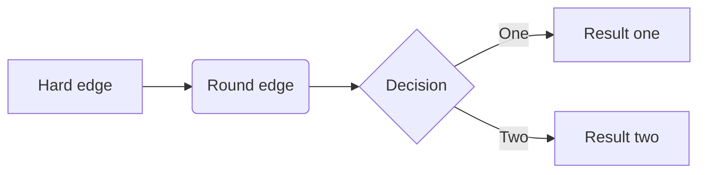
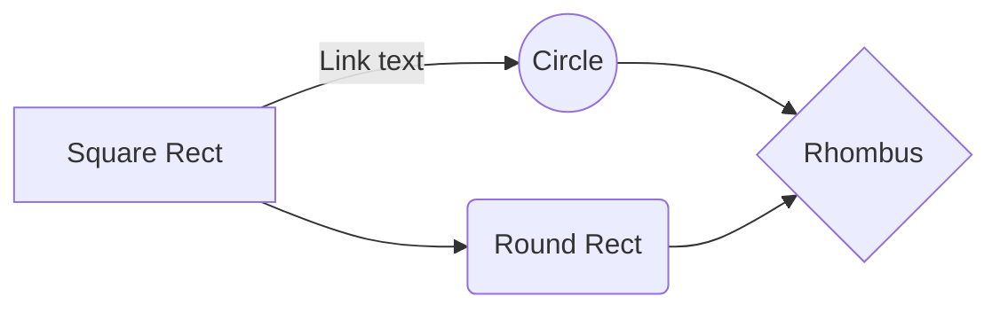
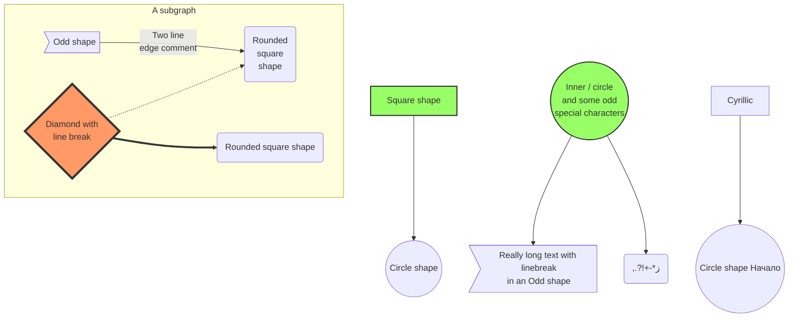

# Prerequisite

1. Install Visual Studio 2017 (**with Net Framework 4.6.1**)
2. Install SQL server 2014 in local machine(**For local development, debug and test**)


***


# Projects brief

## Skills

* [C# (**Net framework 4.6.1**)](https://docs.microsoft.com/en-us/dotnet/csharp/index)
* [OWIN](https://docs.microsoft.com/en-us/aspnet/web-api/overview/hosting-aspnet-web-api/use-owin-to-self-host-web-api)
* [Web API 2](https://docs.microsoft.com/en-us/aspnet/web-api/overview/getting-started-with-aspnet-web-api/tutorial-your-first-web-api)
* [EntityFrameWork 6](https://docs.microsoft.com/en-us/aspnet/web-api/overview/data/using-web-api-with-entity-framework/)
* [HangFire](https://www.hangfire.io/)
* [Autofac](https://autofac.org/)
* COSMOS Scope
* Aether


##	Projects

* OnboardingToolCore

  * Models
  * Db Models
  * Constants
  * Config
  * App.Config
* OnboardingToolDataProvider

  * DbDataProvider
  * Db Migration files
* OnboardingToolOwinService

  * Web API
  * OWIN Service
  * Hangfire Dashboard
  * Autofac
* OnboardingToolServer

  * StartUp project(==start OWIN Service and Worker Scheduler==)
* OnboardingToolService

  * business logic of  workers
* OnboardingToolWorker

  * Workers
  * Parsers
  * Helpers
* OnboardingToolScheduler

  * Autofac
  * Hangfire 
  * Configurable worker schedulers


## Work flow

``` flow

st=>start: Start
op=>operation: Your Operation
web API=>operation: Web API
service=>operation: Business logic service
cond=>condition: Yes or No?
e=>end

st->op->cond
cond(yes)->web API->e
cond(no)->op
service->e
```








